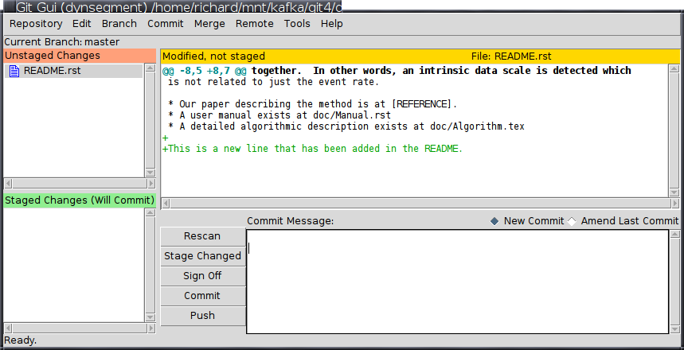
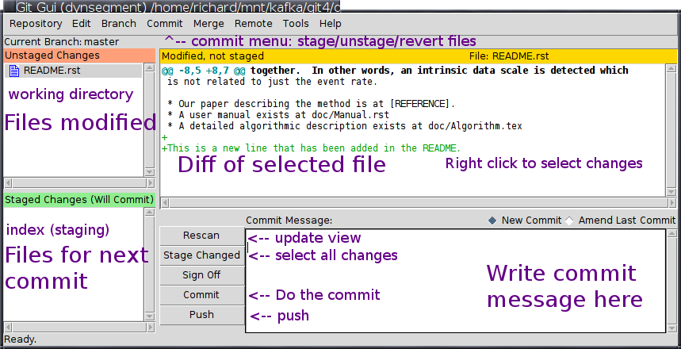
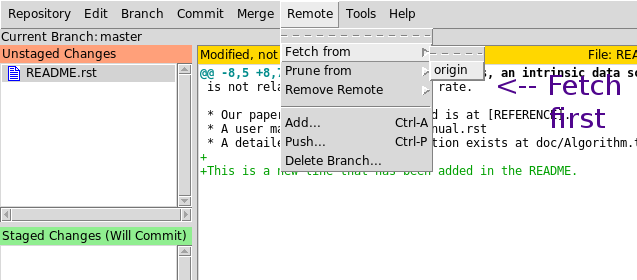
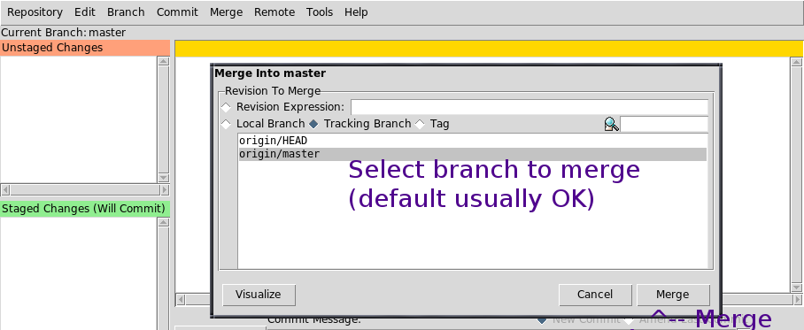
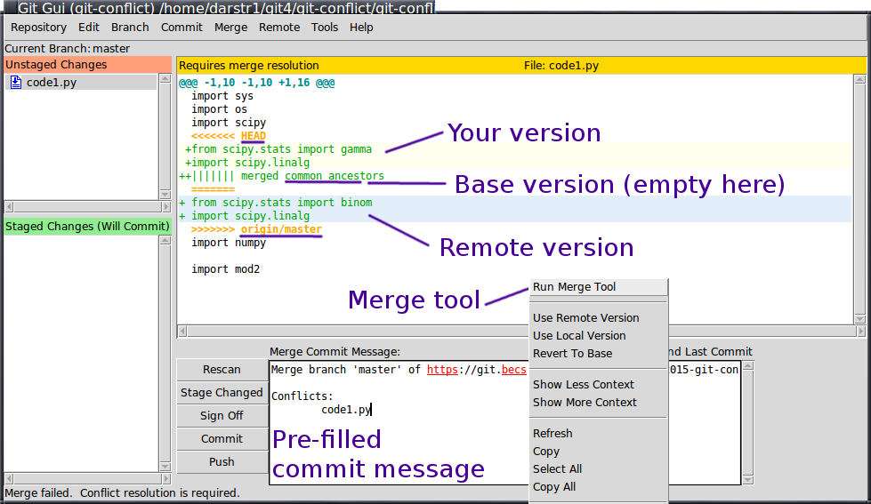
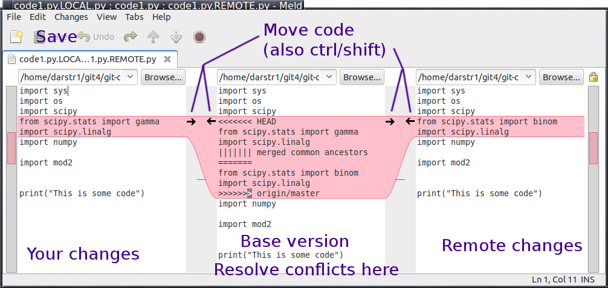

Git GUIs and practical usage
============================

Outline
~~~~~~~
- Graphical user interface(s)
- How to deal with and resolve conflicts
- Other practical tips

Introduction
~~~~~~~~~~~~
- This talk is to help resolve different practical issues with using
  git.
- You won't learn new things, but we will practice what we know
- We will see some more comfortable ways of doing things.

Git GUIs
~~~~~~~~
- There are many of them
- Nothing special about them: a wrapper to all of the normal git
  commands.
- They provide a more comfortable and safe way of doing the same
  things.

``git gui`` and ``gitk``
~~~~~~~~~~~~~~~~~~~~~~~~
- These are included in "standard" git.
- ``git gui``

  - Easy commits
  - Can push, pull, merge
  - Debian/Ubuntu package ``git-gui``.

- ``gitk``

  - A history browser
  - Debian/Ubuntu package ``gitk``.

``gitk``: Viewing history
~~~~~~~~~~~~~~~~~~~~~~~~~
- Allows browsing of history, seeing old versions, etc.
- Doesn't change the repository.

Basic concepts of ``git gui``
~~~~~~~~~~~~~~~~~~~~~~~~~~~~~
- Run ``git gui`` from within the project directory.
- Is a thin but convenient wrapper on top of normal git commands
- Uses the same terminology as ``git``, so you still need to know your
  stuff.

``git gui``: Checking current status (``git status/diff``)
~~~~~~~~~~~~~~~~~~~~~~~~~~~~~~~~~~~~~~~~~~~~~~~~~~~~~~~~~~
- Viewing diffs: examine files at top left and diffs at top right
- History: Repository -> ``Visualize *'s history`` (starts ``gitk``)

The staging area (index)
~~~~~~~~~~~~~~~~~~~~~~~~
- "pre-commit"

  - ``git add`` --> Add things to the index
  - ``git commit`` --> Everything in index becomes a commit

- The GUIs use this concept, so you need to know the terminology.
- My previous talks have not covered this for purposes of simplicity.

``git gui``: Committing changes (``git add/commit``)
~~~~~~~~~~~~~~~~~~~~~~~~~~~~~~~~~~~~~~~~~~~~~~~~~~~~
- Click files at top left
- Examine changes at top right, stage them

  - *Right click* to stage certain hunks, or stage all files (*Stage
    Changed* button), or all of one file (*Commit Menu->Stage to
    Commit*).

- Write commit message (Summary, blank line, long description)
- Click *Commit* button.

``git gui``: Pushing and pulling (``git push/pull``)
~~~~~~~~~~~~~~~~~~~~~~~~~~~~~~~~~~~~~~~~~~~~~~~~~~~~
- Two stages: fetch, merge
  - *Remote -> Fetch From*, then *Merge -> Local Merge*

Exercise 1.1: Basic usage
~~~~~~~~~~~~~~~~~~~~~~~~~
- These exercises are for basic usage of the GUIs.
- Download the packed files: `examples.tar.gz <examples.tar.gz>`_ and untar them.
- If you haven't done so yet, add the aliases from the git-reference:
  `link <../git-reference/git-reference.html>`_

Exercise 1.2: Explore ``git gui``
~~~~~~~~~~~~~~~~~~~~~~~~~~~~~~~~~
- Change to the ``dynsegment`` directory.
- Start ``git gui`` and explore some.
- Find the changed files and what the latest changes are (top left,
  top right).
- Stage each of the changes (right click on the diffs, *Commit-->Stage* to
  commit, or *Stage Changed* button).
- Write a good commit message.
- Click the *Commit* button.

Exercise 1.3: Explore pulling with ``git gui``
~~~~~~~~~~~~~~~~~~~~~~~~~~~~~~~~~~~~~~~~~~~~~~
- Change to the ``dynsegment-pull`` directory (in ``examples.tar.gz``)
  and start ``git gui``.
- Everything should be already ready for the following steps.
- *Remote -> Fetch From -> origin*
- *Merge -> Local Merge*.  Make sure ``origin/master`` is selected.
- Click *Visualize* to see what will happen.  This shows all of the
  new changes using ``gitk``.  When done, close ``gitk``.
- click *Merge*.

Conflicts
~~~~~~~~~
- A conflict happens when two people edit the same **place** at the
  same **time**.
- To minimize conflicts

  - Reduce :math:`\Delta t` so that changes don't overlap in time
    (push/pull more often).
  - Reduce :math:`\Delta x` so that changes aren't in the same line.

Conflict reduction strategies
~~~~~~~~~~~~~~~~~~~~~~~~~~~~~
- Push and pull **often**.

  - Pull, work, commit, push repeat.

- Before doing (major) changes, tell others and get a write lock.
- Don't have too much text on one line.

Anatomy of a conflict
~~~~~~~~~~~~~~~~~~~~~
- You have: The "BASE" version, your version (HEAD), and other
  version.
- Conflict markers where changes *within three lines* on both sides

Graphical merge tools
~~~~~~~~~~~~~~~~~~~~~
- Instead of conflict markers, there are graphical tools to use.
- ``meld`` is a graphical diff tool.  For merges:

  - Left side is your changes, right side is remote changes, middle is
    merged copy.
  - Make the center be the version you want, save it, and close.

- From command line: ``git mergetool -t meld``
- From ``git gui``: After merge that has conflict, right click and
  select merge.
- Meld has options for ignoring whitespace, line breaks, doing word
  diffs, and so on that can be good for LaTeX or malformed files.

Exercise 2.1: Merging conflict
~~~~~~~~~~~~~~~~~~~~~~~~~~~~~~
- Change to the ``git-conflict`` repository (``cd ../git-conflict/``)
  that is included in the ``examples.tar.gz`` from above.
- You can do this either by the command line or ``git gui``.  Better
  yet, you could do both (but not at the same time).
- Start ``git gui`` in the directory.
- Make sure that there are no unstaged changes.
- *Repository -> Visualize all branch history*.  Observe what you see
  for ``master`` and ``origin/master``.  Close ``gitk``.
- In ``git gui``, *Remote -> Fetch From -> Origin*
- Visualize all branch history again.  How did ``origin/master``
  change?  Close ``gitk`` again.
- In ``git gui``, *Merge -> Local Merge*.  Confirm that the defaults
  are what you want, mainly, ``origin/master``.  Click *Merge*.

  - The command will fail.  If you read the message, you see that
    there is a conflict and you have to fix it.

Exercise 2.2: Resolving the conflict
~~~~~~~~~~~~~~~~~~~~~~~~~~~~~~~~~~~~
- Install the Debian/Ubuntu package ``meld`` (if you can).
- Observe the current state of the repository.  You see some unstaged
  changes.
- You should see the conflict markers in the file.  ``HEAD`` indicates
  your side, ``origin/master`` indicates the server version.  ``merged
  common ancestors`` indicates the "base" version.
- Notice the pre-filled commit message, that has the standard text.
  This reminds you that *a merge is in progress* and you shouldn't do
  other work until you handle this.
- You could resolve the conflict right in the GUI, if you wanted.
  Don't do that yet, though.
- Special cases:

  - Mac: You will have to resolve the conflict right in the GUI.  I
    haven't gotten ``meld`` to work on OSX yet.
  - If you don't have meld installed: Resolve right in the GUI.

- Resolving via the GUI:

  - Edit the files.  Remove the conflict markers and put the two
    changes together.
  - Stage the edited file.
  - Edit the commit message, if you want, and click the *Commit*
    button.

- Resolving using ``meld``:

  - Right click on the file and click *Run Merge Tool*.
  - (If needed, you can specify the merge tool as ``meld`` under *Edit
    -> Options*).
  - You are presented with your changes on the left, the remote
    changes on the right, and the current version in the middle.
  - Use the arrows and also keyboard to merge the files together.  You
    can hold alt/control/shift to adjust what meld does.  My
    recommendation is to pick one of the sides and move it to the
    middle.  Then, see what else is different on the other side, and
    add that to the middle.
  - When you are done, save the file in ``meld`` and exit.
  - Stage the file, then commit.

Other tips
~~~~~~~~~~

LaTeX files
~~~~~~~~~~~
- Don't have a paragraph all on one line
- **Don't have a paragraph all on one line**
  - Merge :math:`\Delta x` is large!
- Have one sentence per line.
- Use an editor that wraps lines, but only when you tell it to.

Latexdiff
~~~~~~~~~
- Produce pretty diff between any two versions of a LaTeX file.
- https://github.com/rkdarst/git-latexdiff

How to structure a join project?
~~~~~~~~~~~~~~~~~~~~~~~~~~~~~~~~
- One main codebase.  Gitlab is the master copy.
- Each person has their working copy.
- Common data exists in another location.

  - ``/proj/networks/darst/mobile/``  <-- git repository
  - ``/scratch/networks/mobile/*``  <-- common data, intermediate
    files, etc. that everyone uses

- Pull, work, commit, push.

Using ``gitlab``
~~~~~~~~~~~~~~~~
- Manage who has permissions
- Track issues

Tagging important versions
~~~~~~~~~~~~~~~~~~~~~~~~~~
- ``git tag <name>``
- Used to mark an important version.

Uses of ``git checkout``
~~~~~~~~~~~~~~~~~~~~~~~~
- Revert the latest uncommitted: ``git checkout FILENAME``
- Check out a branch: ``git checkout BRANCHNAME``
- Check out an old version of a file: ``git checkout VERSION
  FILENAME``
- Check out an arbitrary commit: ``git checkout VERSION``

  - This leads to a "detached head" which will cause problems!

Checking out old versions of files
~~~~~~~~~~~~~~~~~~~~~~~~~~~~~~~~~~
- Try to avoid ``git checkout VERSION``, because 25% of the time you
  will forget about it and be in a "detached head" state.
- If this happens, ask Richard for advice.
- Use either of these options instead:
  - ``git checkout VERSION FILENAME``
  - ``gitk`` to view older versions

Any other questions/comments?
~~~~~~~~~~~~~~~~~~~~~~~~~~~~~

Exercise 3.1: groupwork
~~~~~~~~~~~~~~~~~~~~~~~
- This is a freely-guided exercise with no particular plan
- Clone this project:
  - https://git.becs.aalto.fi/complex-networks/tutorial
- Discuss among all the group about modifications.  Make modifications
  and pus them back.  Try to minimize conflicts!

