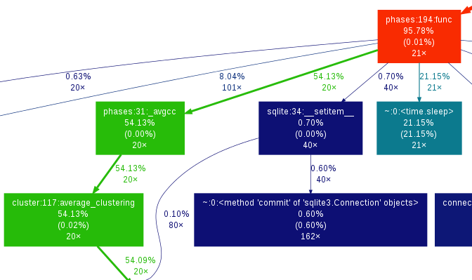
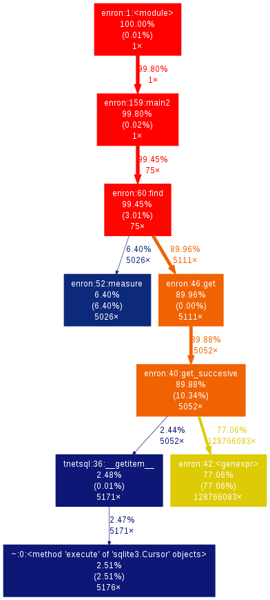
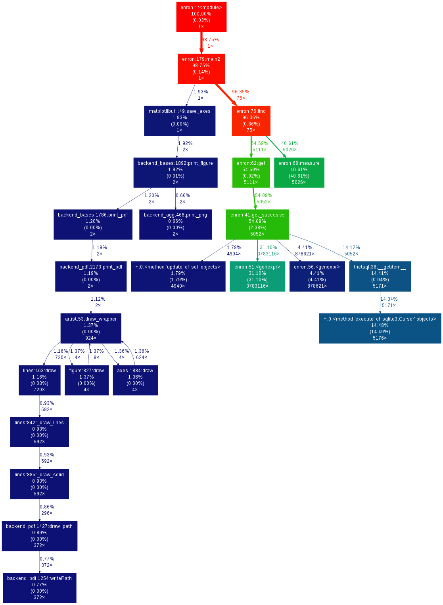
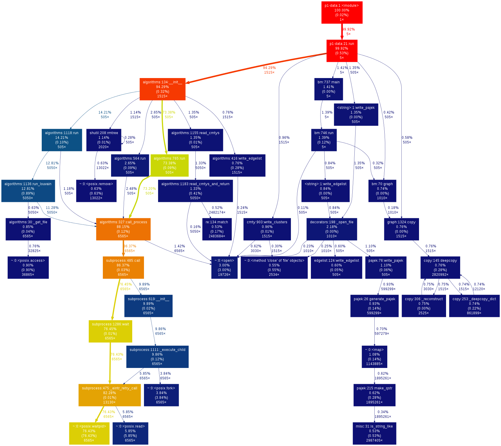

Time-profiling code
===================

Scientists "know" that faster programs is better.  But what does this
mean?

First, most of the time you will spend more time writing programs than
running them.  All the previous talks optimize writing, debugging,
collaborating, and maintaining programs and is the most important
thing you can do.

But as for optimizing program speed, there is one saying you see
everywhere: **Premature optimization is the root of all evil**.  This
means, first you want to make a *good* program, then *profile* it to
see where the slow parts are, then *optimize just those parts*.  This
talk is about **profiling: the process of systematically examining
program execution times to learn the bottlenecks**

Outline
~~~~~~~

- What is profiling?

  - Real example: profile and call graph

- How to generate profiles

- What to look for

- Advanced tools and tips

- "Optimizing"

Profiling and optimizing
~~~~~~~~~~~~~~~~~~~~~~~~

- **Profiling**: A form of dynamic program analysis that measures time
  (or space) usage of a program.

- Faster is better.  But what part is slowest?

  - Usually writing, debugging, collaborating, maintaining.

- 10% of code is 90% of run time.

  - You only want to work on that 10%, but what 10% is it?

There is a famous saying:

**Premature optimization is the root of all evil**

.. epigraph::

   What this saying means is that you should not try to optimize your
   program before writing it.  Programs are very complex interactions
   between processor architectures, memory, multiple layers of caches,
   compilers, and the instructions themselves.  If you try to guess
   where the slow part is, you will probably get it wrong and end up
   wasting your time.

Profiling
~~~~~~~~~

Wikipedia: **Profiling** is dynamic program analysis of time, space, or
other resource usage.

- This talk focuses exclusively on *time profiling*.

- Profiling will help us find **bottlenecks** in the code, that use up
  most of the time.  We then work on the code around the bottleneck.

- Computers and programs are very complex, with many subtleties in
  processor pipelines, caches, compiler optimizations, and so on.

- The actual program speed *can't* always be easily predicted from
  the code itself!  **This is the point of profiling first, then
  optimizing**.

Example from my work
~~~~~~~~~~~~~~~~~~~~

- Call graph: directed graph showing which functions call which.  It
  can (like this one) also have time information associated with it
  to make it a time profile.

- The image linked here is an example of a profile call graph from my
  work.  Let's examine it.

Example output (click link):

.. epigraph::

   This is a directed graph showing the flow of time through the
   program.  At the top is the entry point, and looking down you see
   the flow of time (in fraction of total time) distributed among all
   functions.  Colors serve as a visual aid to see where the hot spots
   are.  Arrows point from callers to callees, and include number of
   times called.

   This is not "a profile".  This is one representation of a profile.

How to collect the profiling data
~~~~~~~~~~~~~~~~~~~~~~~~~~~~~~~~~

- Step 1: have a good, clean program that works correctly.

.. epigraph::

   Remember, the whole point of this is that you should write good
   programs first, and then profile.  Of course, sometimes you will
   profile during development, but don't go crazy sacrificing
   readability for optimizations.  Chances are that will be refactored
   out later anyway.

Collecting profiling information
~~~~~~~~~~~~~~~~~~~~~~~~~~~~~~~~

In the first step, we run the program using the ``cProfile`` module.
This just stores up the profile information, and we will examine it in
the next step.

Change this:

.. python::

   $ python SCRIPT.py arg1 arg2 ....

To this:

.. python::

   $ python -m cProfile -o profile.out  SCRIPT.py arg1 arg2 ....

Explanation:

- ``python -m cProfile``: Run library module ``cProfile`` as a script.

- ``-o profile.out``: Tells ``cProfile`` to write the profile to the
  file ``profile.out``.

- ``SCRIPT.py arg1 arg2 ...``: Your normal ``python`` interpreter arguments.

- The output ``profile.out`` contains details of all function calls
  and times.

The next step is to visualize or analyze the data in ``profile.out``.

.. epigraph::

   I personally prefer first running and storing the profile in
   ``profile.out``, and then visualizing, to be better.  If the call
   graph is not useful enough, I can visualize it again using
   different options or examine it using the command line for more
   details.  Also, if I make a change, I can compare the new and old
   profiles to see how it affected things.  This is important!

   ``python -m MODULE`` is the same as "python /path/to/the/MODULE.py".
   It is a common shortcut.

   This step works on any platform.

   Sample output: `profile-growsf.out <./profile-growsf.out>`_

Visualizing the profile information (gprof2dot)
~~~~~~~~~~~~~~~~~~~~~~~~~~~~~~~~~~~~~~~~~~~~~~~

- ``gprof2dot.py`` is a call graph visualizer.  It is my main tool for
  profile visualization.

- It takes the ``profile.out`` and converts it to a call graph in the
  ``graphviz`` language, which can then be visualized or analyzed in
  different ways.  You then use graphviz (``dot``) to make a picture.

- This command runs everything and displays the output all at once.

  .. code:: console

     $ python gprof2dot.py -f pstats profile.out | dot -Tpng | display

  This creates and displays the PNG all in one go.

- Download ``gprof2dot.py`` (it's a single script file) and get help here:
  https://code.google.com/p/jrfonseca/wiki/Gprof2Dot

Example output (click link):

.. epigraph::

   This assumes that you are on Linux, or some operating system with
   pipes, and graphviz installed.  There are graphviz tools for other
   platforms.

   If you want to save the image, change ``|display`` to ``> profile.png``.

Some nomenclature
~~~~~~~~~~~~~~~~~

- Total time: time spent in a function itself.

  - Tells you that *the code in this function* is taking a lot of time.

- Cumulative time: time spent in a function and all functions it
  called.

  - Tells you that *this function* is taking a lot of time.  Perhaps
    it is calling other functions unnecessarily.

- Callers: functions which called some function.

- Callees: functions which some function calls.

What to look for in a profile
~~~~~~~~~~~~~~~~~~~~~~~~~~~~~

- What functions take most time?

- Who calls the functions that take most time?  Often, the actual
  critical function is several steps up.

- (in Python) C-implemented functions or methods do not appear.

- You generally want to find things that are surprising: that are
  using lots of time but *shouldn't* be major operations.  You want
  the actual computation part to take most of the time.

- Each time you improve some things, re-generate the profile to see
  new hotspots.

.. epigraph::

   There are also tools for line-based, instead of function-based,
   profiling.  However, due to the overheads of Python it's not common
   there.

   I don't have magic suggestions on how to improve things.  After
   seeing enough profiles, and a future optimization talk, you will
   gain intuition on how to do things.  Most importantly, by examining
   profiles before and after your changes, you will be in a position
   to know what works and what doesn't.

Example: profile before and after optimization
~~~~~~~~~~~~~~~~~~~~~~~~~~~~~~~~~~~~~~~~~~~~~~~

Here, you see two call graphs: before and after optimization.

- What I actually changed: I realized my caching was not working and
  it was generating some data too many times.  I fixed that

- Then,  notice that the "hot" branch slows becomes less important, and we
  see that its importance greatly decreases, and many other branches
  appear.  By default ``gprof2dot`` has a node time threshold of 0.5%.

.. epigraph::

   Profile sources: `before <profile-temporal-2-pre.prof>`_ and `after
   <profile-temporal-2-post.prof>`_.

Example: calling external processes
~~~~~~~~~~~~~~~~~~~~~~~~~~~~~~~~~~~

Profile source: `profile-external.out <profile-external.out>`_

.. epigraph::

   On the left of this figure, we see various external community
   detection methods running using the ``subprocess`` module.

Advanced
~~~~~~~~

Examining profile.out from the command line
~~~~~~~~~~~~~~~~~~~~~~~~~~~~~~~~~~~~~~~~~~~

You can examine the raw ``profile.out`` data using the command line,
without making a picture.

.. code:: console::

   $ python -m pstats profile.out

   % strip           # make output names shorter
   % sort time       # Sort by time
   % stats 15        # Print top 15 lines

Output::

   ncalls  tottime  percall  cumtime  percall filename:lineno(function)
  1000020  119.340    0.000  134.635    0.000 cluster.py:59(_triangles_and_degree_iter)
       21   53.178    2.532   53.178    2.532 {time.sleep}
      381   18.685    0.049   18.685    0.049 {cPickle.loads}
       20    9.450    0.473   13.629    0.681 cmtyembed.py:67(nembed_m)
 10999400    7.203    0.000    7.203    0.000 graph.py:294(__getitem__)

Available commands:

strip
    shorten filenames (recommended)
sort [ time | cumul | other ]
    sort the data by total time, cumulative time, or any of the options.
print N
    print first N entries
callees [funcname]
    Print functions which ``funcname`` called and time spent in each -
    *only* time spent in direct calls from ``funcname``

callers [funcname]
    Print functions which called ``funcname`` and how much time was
    spent in calls from each function.

.. epigraph::

   Let's study the difference in total time and cumulative time by
   looking at `profile-external.out <profile-external.out>`_.

   Sorting by total time (``sort time``), we see that internal
   subprocess calls take up most of the time, and this is expected.  I
   scan down the list of functions until I get to the first function
   that I actually wrote, and it is ``run_louvain``.  I see that this
   takes up only 9 seconds out of 803 total seconds.  So I consider
   this program to be written well enough, since I can't change
   subprocess (perhaps I could call the program in a way that doesn't
   read in data, but I don't want to do that now.)

   ::

         ncalls  tottime  percall  cumtime  percall filename:lineno(function)
           6565  803.707    0.122  803.707    0.122 {posix.waitpid}
           6565   61.486    0.009   61.486    0.009 {posix.read}
           6565   40.397    0.006   40.397    0.006 {posix.fork}
          19726   31.600    0.002   31.600    0.002 {open}
          36865    9.419    0.000    9.419    0.000 {posix.access}
           5050    9.411    0.002  134.704    0.027 algorithms.py:1136(run_louvain)
          13022    6.612    0.001    6.612    0.001 {posix.remove}
           2534    5.746    0.002    5.746    0.002 {method 'close' of 'file' objects}
              5    5.569    1.114 1050.805  210.161 p1-data.py:21(run)
        2987405    5.558    0.000    5.558    0.000 misc.py:31(is_string_like)
           5050    4.332    0.001   14.017    0.003 algorithms.py:1183(read_cmtys_and_return)
          18622    3.723    0.000    3.723    0.000 {posix.lstat}
           1515    3.401    0.002  991.595    0.655 algorithms.py:134(__init__)
      2820992/1515    2.968    0.000    7.946    0.005 copy.py:145(deepcopy)
        1895261    2.957    0.000    6.497    0.000 pajek.py:215(make_qstr)

   Now, let's sort it by cumulative time (``sort cumul``).  You see that the ``<module>`` takes up all the time, as you expect.

   ::

      ncalls  tottime  percall  cumtime  percall filename:lineno(function)
           1    0.184    0.184 1051.619 1051.619 p1-data.py:1(<module>)
           5    5.569    1.114 1050.805  210.161 p1-data.py:21(run)
        1515    3.401    0.002  991.595    0.655 algorithms.py:134(__init__)
        6565    1.226    0.000  927.022    0.141 algorithms.py:327(call_process)
        6565    0.279    0.000  908.277    0.138 subprocess.py:485(call)
       13130    0.119    0.000  865.313    0.066 subprocess.py:475(_eintr_retry_call)
        6565    0.126    0.000  803.927    0.122 subprocess.py:1286(wait)
        6565  803.707    0.122  803.707    0.122 {posix.waitpid}
         505    0.985    0.002  771.701    1.528 algorithms.py:765(run)
         505    1.059    0.002  149.446    0.296 algorithms.py:1118(run)
        5050    9.411    0.002  134.704    0.027 algorithms.py:1136(run_louvain)
        6565    0.230    0.000  103.976    0.016 subprocess.py:619(__init__)
        6565    1.258    0.000  103.684    0.016 subprocess.py:1111(_execute_child)
        6565   61.486    0.009   61.486    0.009 {posix.read}
        6565   40.397    0.006   40.397    0.006 {posix.fork}

   I just know what files most of these functions are in.  If you see
   a file name that you don't recognize, like misc.py, restart the
   profile browser and don't run ``strip`` and you will see full file
   names.

   References:

    - https://docs.python.org/2/library/profile.html
    - Better tutorial: ???

Profile C code
~~~~~~~~~~~~~~

Any decent language will have profiling facilities.  For C:

- Compile with ``gcc -pg``

  - This compiles the code to output profiling data when run (adds hooks
    for profiling)

  - Different compilers can have different options.

- Run the program as normal

  - You will then find a file ``gmon.out`` with the profiling data.

- View it with ``gprof``: ``gprof a.out gmon.out``.  The interface is
  like the Python command-line profiling.  You can also use
  ``gprof2dot`` in the same way as Python, without ``-f pstats``.

.. epigraph::

   C code must be compiled with profile support, and then it
   automatically appears when you run it, unlike Python where you run
   it differently to invoke the profiling hooks.

   C (and other compatible compiled codes), in general, has a whole
   lot more instrumentation capabilities.

gprof example profile output (C code)
~~~~~~~~~~~~~~~~~~~~~~~~~~~~~~~~~~~~~

.. pyinc:: c c-profiling.c

Output::

    %   cumulative   self              self     total
   time   seconds   seconds    calls  us/call  us/call  name
  101.15      0.62     0.62    30000    20.57    20.57  y
    0.00      0.62     0.00    10000     0.00    41.13  f

% time
  Self explanatory, fraction of time in this function.

self seconds
  Seconds spent in this functions code.

total seconds
  Seconds spent in a function *and functions called by this function*.

.. epigraph::

   As we can see, this is pretty similar to the output from the
   ``pstats`` command line browser.  You can also use ``gprof2dot`` on
   ``gmon.out``, as well as lots of other tools.

Stochastic vs deterministic profiling
~~~~~~~~~~~~~~~~~~~~~~~~~~~~~~~~~~~~~

- **Deterministic profiling**: Trace every function execution and
  return and record all times.

  - Introduces overhead in *every* function call.

  - More accurate in that it records every function call.

- **Statistical profiling**: At random intervals, record the program's
  call stack.

  - Less overhead in the execution.

  - More accurate in that it won't affect the runtime so much.

  - ``oprofile`` is a suite (with Linux kernel module) that can do
    this on already running code (C only).

.. epigraph::

   Everything in this talk uses deterministic profiling, and probably
   it is the main thing you will use.  However, you should know that
   there is a wide variety of techniques behind profiling, including
   some serious tools for dynamic program analysis.  If you ever have
   a program with mainly small, fast function calls, consider
   stochastic profiling.

Profiling from the Python shell (and ipython)
~~~~~~~~~~~~~~~~~~~~~~~~~~~~~~~~~~~~~~~~~~~~~

To profile something from the Python shell, or only one function
within a program:

.. code::

   import cProfile
   cProfile.run('func()', 'filename.out')

- Stores pstats output in ``filename.out`` for examination in other
  programs.  Leave off filename argument to just print it.

IPython has a shortcut for running this.  I would usually save it to
another file and visualize with ``gprof2dot.py``.

.. code::

   %prun [-s sort-key] [-D filename.out] [statement]

- Prints a profile to the screen.  With -D, save the standard pstats
  output for visualization in gprof2dot or other programs.

.. epigraph::

   These tools can make and print the text-based profile all in one
   go.  Perhaps that is useful sometimes from the command line for
   quick things.  For big things, I'd generally prefer to make and
   save to a file for further analysis.

Other profiling tools
~~~~~~~~~~~~~~~~~~~~~

- pycallgraph (produces .png directly from running program)

- ``runsnakerun``: simple area-based view, for Python.

- ``oprofile`` - system-wide statistical profiler.

- Memory profiling in Python: Meliae: https://launchpad.net/meliae

.. epigraph::

   ``oprofile`` is a neat kernel-based profiler.  It can profile
   everything on your system, and make line-based profiles.  (Example
   `line profile <oprofile_annotate_APM>`_ and `summary report
   <oprofile_report_APM>`_)

   Memory profiling is tricky in Python.  Since objects have shared
   ownership, you can't tie them to specific locations in code so
   easily.  I have rarely needed to use memory profiling in Python.

How to use your profile: Actually optimizing your code
~~~~~~~~~~~~~~~~~~~~~~~~~~~~~~~~~~~~~~~~~~~~~~~~~~~~~~

- This tutorial does *not* talk about optimizing, the process of actually
  making these things go faster (that's a future tutorial!).

- Rough suggestions:

  - Try different methods for calculating stuff.

  - Add a caching layer to save computing things over and over.  Use
    dictionaries well.

  - Algorithmic improvements (future talk).  If possible, it's best to
    replace, not rewrite, these parts.

  - Move just the slow part to C.

- There are some optimization resources at the end of this talk.

Conclusions
~~~~~~~~~~~

- Premature optimization is the root of all evil.

- Profile before you optimize.

- Call graphs represent the flow of time through your program.

- This talk does *not* talk about optimizing itself.

Resources
~~~~~~~~~

- Profiling in general

  - https://en.wikipedia.org/wiki/Profiling_%28computer_programming%29

- Python tools

  - http://docs.python.org/2/library/profile.html

  - https://code.google.com/p/jrfonseca/wiki/Gprof2Dot (also has
    instructions for other languages)

  - http://www.vrplumber.com/programming/runsnakerun/

  - Python line profiler https://pypi.python.org/pypi/line_profiler/
    (`source <https://github.com/rkern/line_profiler>`_)

- Optimization of Python

  - https://wiki.python.org/moin/PythonSpeed

  - https://wiki.python.org/moin/PythonSpeed/PerformanceTips

  - https://wiki.python.org/moin/TimeComplexity

  - http://wiki.scipy.org/PerformancePython - moving slow parts into numpy/C

- Other tools/languages

  - gprof: http://www.cs.utah.edu/dept/old/texinfo/as/gprof.html

  - Valgrind (huge dynamic program analysis tool): http://valgrind.org/
